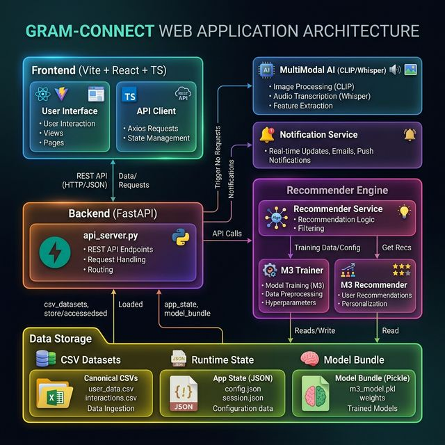

# Gram Connect

Gram Connect is a FastAPI + Vite application for matching community problems to volunteer teams. The repo now includes a canonical synthetic dataset, a real model-training path, real multimodal verification, and a live browser integration suite against the backend.

## Repo Layout
- `backend/`: FastAPI service, recommender logic, multimodal helpers, tests
- `frontend/`: Vite + React + TypeScript UI
- `data/`: canonical seeded dataset assets and media fixtures
- `docs/`: backend contract notes and architecture diagrams

## System Architecture



The project follows a modern decoupled architecture with a FastAPI backend and a Vite+React frontend. It integrates multimodal AI services (CLIP for vision, Whisper for audio) and a custom hybrid recommendation engine (M3).

## Model Spec

The persisted recommender architecture, feature stack, early-stopping policy, and runtime behavior are documented in [docs/model_spec.md](docs/model_spec.md).

## Canonical Seeded Data
- `backend/generate_canonical_dataset.py` is the source of truth for the repo's synthetic dataset.
- Running it regenerates:
  - `data/people.csv`
  - `data/proposals.csv`
  - `data/pairs.csv`
  - `data/village_locations.csv`
  - `data/village_distances.csv`
  - `data/schedule.csv`
  - `data/runtime_profiles.csv`
- The backend now seeds its runtime state from those files and persists live app state under `backend/runtime_data/app_state.json`.
- The trained demo model is persisted at `backend/runtime_data/canonical_model.pkl` and is the only default model path used by the backend runtime.

## Verified Linux Setup

### Backend
```bash
cd backend
python3 -m venv .venv
source .venv/bin/activate
python -m pip install --upgrade pip
python -m pip install torch torchvision --index-url https://download.pytorch.org/whl/cu124
python -m pip install -r requirements.txt
python -m pip install pytest
python generate_canonical_dataset.py
python -m pytest tests -q
python run_full_verification.py
python -m uvicorn api_server:app --host 127.0.0.1 --port 8011
```

Notes:
- PyTorch is intentionally installed from the official CUDA wheel index first.
- `run_full_verification.py` trains and persists `backend/runtime_data/canonical_model.pkl`, verifies recommendation inference, schedule filtering, CLIP image analysis, and Whisper transcription.
- The backend runtime fails closed if the trained bundle is missing. In normal demo flow, `backend/start_e2e_backend.py` or the FastAPI startup bootstrap trains it first.
- Dataset paths auto-resolve from the repo or from `GRAM_CONNECT_*` environment variables.
- The backend default runtime state is seeded from canonical CSVs, not hand-written demo records.

### Frontend
In a second terminal:
```bash
cd frontend
npm install
printf 'VITE_API_BASE_URL=http://127.0.0.1:8011\n' > .env
npm test -- --run
npm run typecheck
npm run lint
npm run build
npm run test:e2e
npm run dev
```

Open the URL printed by Vite, usually `http://127.0.0.1:5173`.

### Primary Demo Routes
- `/` home and entry points
- `/villager-onboarding` public villager profile setup
- `/submit` problem submission with audio/image persistence
- `/dashboard` coordinator dashboard with AI assignment and live map embed
- `/map` full-screen geospatial view
- `/volunteer-dashboard` volunteer tasks and proof upload flow
- `/profile` volunteer profile editor

## Test Credentials
- Coordinator: `coordinator@test.com` / `password`
- Volunteer: `volunteer@test.com` / `password`

## What Was Verified
- Backend test suite: passing
- Frontend unit tests: passing
- Frontend typecheck: passing
- Frontend lint: passing
- Frontend production build: passing
- Backend full model verification:
  - real model training
  - recommendation inference
  - schedule-filter behavior
  - `POST /recommend`
  - `POST /analyze-image`
  - `POST /transcribe`
- Frontend Playwright integration:
  - coordinator login and dashboard filtering
  - AI team generation and assignment
  - image-assisted problem submission
  - volunteer task completion flow

## One-Command Full Verification
```bash
scripts/full_verify.sh
```

That runs:
- backend dataset generation
- backend unit and smoke tests
- backend full model verification
- frontend unit tests
- frontend typecheck
- frontend lint
- frontend production build
- frontend browser integration tests

## Path Overrides
The canonical trained model is always served from `backend/runtime_data/canonical_model.pkl`.
Optional dataset overrides remain available for regeneration and experiments:
`GRAM_CONNECT_PEOPLE_CSV`, `GRAM_CONNECT_PROPOSALS_CSV`, `GRAM_CONNECT_PAIRS_CSV`, `GRAM_CONNECT_VILLAGE_LOCATIONS_CSV`, and `GRAM_CONNECT_DISTANCE_CSV`.
